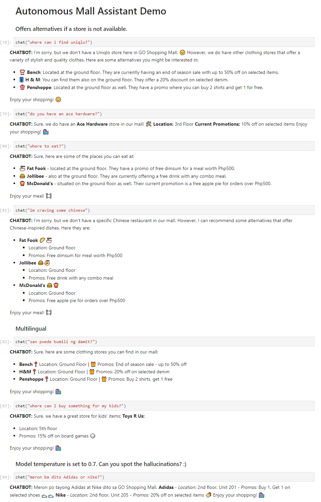

# Autonomous Mall Assistant


## Description

`autonomous-mall-assistant` is an AI-powered mall assistant designed to help shoppers easily locate stores within a shopping mall. The system utilizes a Large Language Model (LLM) to understand user queries and provide precise information or alternative suggestions.


## How it Works


1. User interacts with the chat interface to ask about a specific store or retail category.
2. The LLM identifies the `store name` and `retail category` from the user's query.
3. The system searches the database (pandas df) for the store information.
    - If found, returns relevant details to the LLM as context data.
    - If not found, suggests alternative stores from the same retail category and return it to the LLM to propose to the users as alternatives.


## Demo





## Tech Stack


- GPT-4
- LangChain
- pandas


## Installation


```bash
1. clone this repo
2. pip install requirements.txt
3. run autonomous-mall-assistant.ipynb


Notice: README.md created with help from ChatGPT