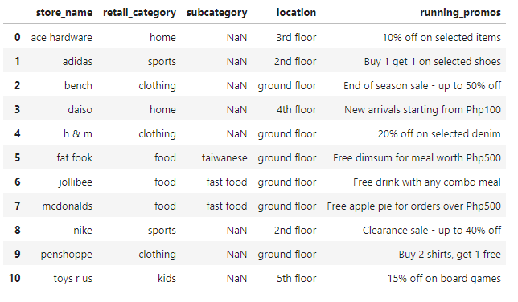
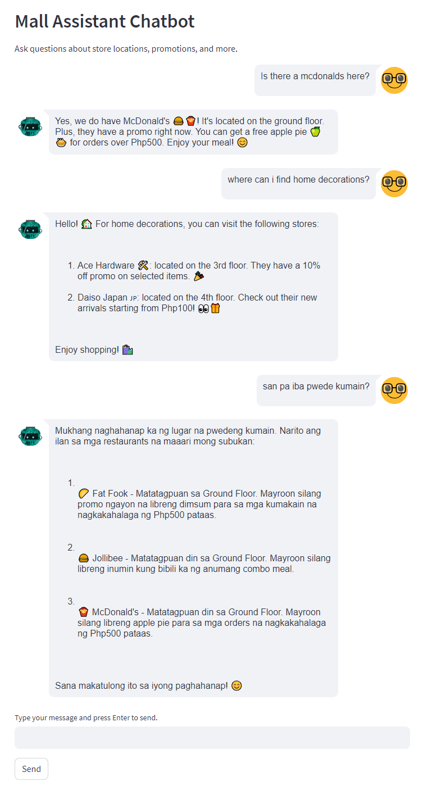

# Autonomous Mall Assistant


## Description

`autonomous-mall-assistant` is an AI-powered mall assistant designed to help shoppers easily locate stores within a shopping mall. The system utilizes a Large Language Model (LLM) to understand user queries and provide precise information or alternative suggestions.


## How it Works


1. User interacts with the chat interface to ask about a specific store or retail category.
2. The LLM identifies the `store name` and `retail category` from the user's query.
3. The system searches the database (pandas df) for the store information.
    - If found, returns relevant details to the LLM as context data.
    - If not found, suggests alternative stores from the same retail category and return it to the LLM to propose to the users as alternatives.


## Demo
Stores Database - stored as a pandas dataframe but you should be able to use any other DBs (e.g. SQL/NoSQL) as long as you can wrap it into a function.

](img/image-3.png)

### Q and A with the Assistant
Note: more examples in autonomous-mall-assistant.ipynb


](img/image-2.png)

## Roadmap

- Add mall wide events/promotions to the output
- Handling of multiple stores/categories in user input


## Tech Stack


- GPT-4
- LangChain
- pandas
- streamlit
- streamlit-chat


## Installation


```bash
1. clone this repo
2. pip install requirements.txt
3.1 run autonomous-mall-assistant.ipynb OR
3.2 cd to streamlit_frontend and run `streamlit run app.py` in terminal
```

## Contributing

...is welcome! 🤗

## Developer Notes

Placeholder

## Author


#### Stephen Bonifacio

Feel free to connect with me on:

Linkedin: https://www.linkedin.com/in/stephenbonifacio/  
Twitter: https://twitter.com/Stepanogil  

Notice: README.md created with help from ChatGPT

