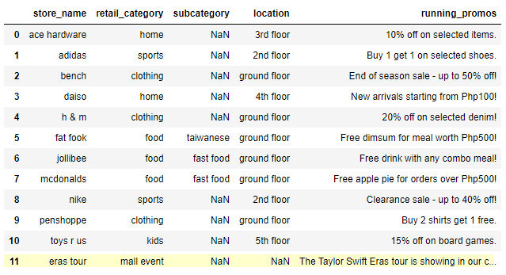
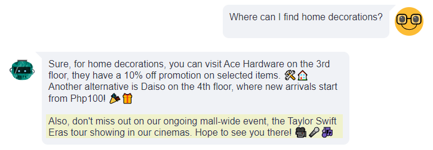

# Autonomous Mall Assistant


## Description

`autonomous-mall-assistant` is an AI-powered mall assistant designed to help shoppers easily locate stores within a shopping mall. The system utilizes a Large Language Model (LLM) to understand user queries and provide precise information or alternative suggestions.


## How it Works


1. User interacts with the chat interface to ask about a specific store or retail category.
2. The LLM identifies the `store name` and `retail category` from the user's query.
3. The system searches the database (pandas df) for the store information.
    - If found, returns relevant details to the LLM as context data.
    - If not found, suggests alternative stores from the same retail category and return it to the LLM to propose to the users as alternatives.


## Demo
Stores Database - stored as a pandas dataframe but you should be able to use any other DBs (e.g. SQL/NoSQL) as long as you can wrap it into a function.



### Q and A with the Assistant
Note: more examples in autonomous-mall-assistant.ipynb


](img/image-2.png)

Mentions mall wide events, if any.



## Roadmap

- ~~Add mall wide events/promotions to the output~~ - Completed on [2023-11-05]
- Add mall general info like opening hours; exceptions to the scheds because of special holidays, etc.
- Define handling of multiple stores/categories in user input.
- Incorporate some guardrail mechanism e.g., nemo guardrails.
- (longish-term) Breakdown the single `search_store` function into their respective retail category functions to handle targeted queries (e.g., sports - "Does Nike sell football boots?", food - "Which restaurants offer halal food?")
- (longish-term) Utilize a better database that can scale better (e.g., managed DB offerings from Azure, AWS, etc.)
- (longish-term) Add GPT-4 tool/function for complex queries requiring reasoning ability.


## Tech Stack


- GPT-4
- LangChain
- pandas
- streamlit
- streamlit-chat


## Installation


```bash
1. clone this repo
2. pip install requirements.txt
3.1 run autonomous-mall-assistant.ipynb OR
3.2 cd to streamlit_frontend and run `streamlit run app.py` in terminal
```

## Contributing

...is welcome! 🤗

## Developer Notes

- **[2023-11-05]**: Implemented `Chat History` feature to maintain conversation context. Since LLM API interactions are stateless, this enhancement captures and sends the entire history of user-AI exchanges alongside the current user query, enabling the LLM to generate contextually relevant responses.

## Author


#### Stephen Bonifacio

Feel free to connect with me on:

Linkedin: https://www.linkedin.com/in/stephenbonifacio/  
Twitter: https://twitter.com/Stepanogil

Did you find this useful? If you'd like to show some love, I won't say no to a cup of coffee! 🤗

[](https://ko-fi.com/Q5Q6QPABZ)


